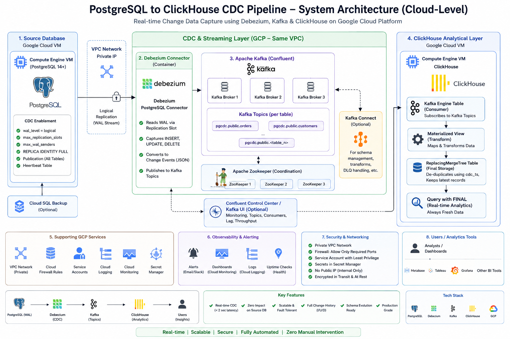

# postgres-kafka-clickhouse-cdc

A production-grade Change Data Capture pipeline that streams every INSERT, UPDATE, and DELETE from PostgreSQL into ClickHouse in under 2 seconds — without touching your application code.

Built and battle-tested on GCP with 287 tables and millions of rows.

---

## How It Works

```
┌─────────────────────┐         WAL stream         ┌─────────────────────────────────────┐
│                     │ ─────────────────────────▶ │         Docker Compose (VM2)         │
│   PostgreSQL 14     │                             │                                     │
│   (VM1)             │   logical replication slot  │  ┌──────────┐     ┌─────────────┐  │
│                     │ ◀─────────────────────────  │  │          │     │             │  │
│  wal_level=logical  │                             │  │ Debezium │────▶│    Kafka    │  │
│  publication        │                             │  │ Connect  │     │   Broker    │  │
│  replica identity   │                             │  │          │     │             │  │
└─────────────────────┘                             │  └──────────┘     └──────┬──────┘  │
                                                    │  ┌──────────┐            │         │
                                                    │  │Zookeeper │            │ topics  │
                                                    │  └──────────┘            │         │
                                                    └─────────────────────────┼─────────┘
                                                                              │
                                                                              ▼
                                                    ┌─────────────────────────────────────┐
                                                    │         ClickHouse (VM2)             │
                                                    │                                     │
                                                    │  Kafka Engine Table                 │
                                                    │       ↓  (consumer)                 │
                                                    │  Materialized View                  │
                                                    │       ↓  (transform)                │
                                                    │  ReplacingMergeTree                 │
                                                    │       ↓  (deduplicate)              │
                                                    │  Query with FINAL                   │
                                                    └─────────────────────────────────────┘
```

**Data flow in plain english:**
1. Your app writes to PostgreSQL as usual — no changes needed
2. PostgreSQL writes to its WAL (Write-Ahead Log) with `wal_level=logical`
3. Debezium reads the WAL via a replication slot and publishes JSON events to Kafka
4. Each table gets its own Kafka topic: `pgcdc.public.orders`, `pgcdc.public.customers`, etc.
5. ClickHouse's Kafka Engine consumes those topics continuously
6. A Materialized View transforms and inserts rows into a ReplacingMergeTree table
7. You query the final table — always fresh, always fast

---

## Stack

| Component | Version | Role |
|-----------|---------|------|
| PostgreSQL | 14+ | Source database |
| Debezium | 2.4 | CDC engine (reads WAL) |
| Apache Kafka | 3.5 (CP 7.5) | Durable event transport |
| Zookeeper | CP 7.5 | Kafka coordination |
| ClickHouse | 26.x | Analytical sink |
| Docker Compose | v2 | Kafka/Debezium orchestration |
| Kafka UI | latest | Web monitoring dashboard |

---

## Prerequisites

- Two Ubuntu 22.04 VMs on the same private network
- PostgreSQL 14+ already running on VM1
- ClickHouse already running on VM2
- Docker + Docker Compose v2 installed on VM2
- Port access: VM2 → VM1:5432, ClickHouse → VM2:29092

---

## Project Structure

```
postgres-kafka-clickhouse-cdc/
├── docker-compose.yml        # Kafka + Debezium + Kafka UI stack
├── .env.example              # Environment variables template
├── Makefile                  # Helper commands
├── debezium/
│   └── connector.json        # Debezium PostgreSQL connector config
├── postgres/
│   └── init.sql              # PostgreSQL CDC setup (WAL, user, publication)
├── clickhouse/
│   └── setup.sql             # ClickHouse tables + Materialized Views
├── monitoring/
│   └── prometheus.yml        # Prometheus scrape config
└── docs/
    └── troubleshooting.md    # Common failure scenarios
```

---

## Setup Guide

### Step 1 — PostgreSQL (VM1)

Connect to your PostgreSQL instance and run:

```sql
-- 1. Enable logical replication (requires restart)
ALTER SYSTEM SET wal_level = logical;
ALTER SYSTEM SET max_replication_slots = 10;
ALTER SYSTEM SET max_wal_senders = 10;
-- restart PostgreSQL after this
```

```sql
-- 2. Create Debezium user
CREATE USER debezium WITH REPLICATION LOGIN PASSWORD 'your_strong_password';
GRANT CONNECT ON DATABASE your_db TO debezium;
GRANT USAGE ON SCHEMA public TO debezium;
GRANT SELECT ON ALL TABLES IN SCHEMA public TO debezium;
ALTER DEFAULT PRIVILEGES IN SCHEMA public GRANT SELECT ON TABLES TO debezium;

-- 3. Set replica identity (needed for UPDATE/DELETE tracking)
-- Run for each table you want to capture
ALTER TABLE your_table REPLICA IDENTITY FULL;

-- 4. Create heartbeat table (prevents WAL disk bloat on idle DBs)
CREATE TABLE public.debezium_heartbeat (
    id INTEGER PRIMARY KEY,
    heartbeat_ts TIMESTAMP WITH TIME ZONE DEFAULT NOW()
);
GRANT SELECT, INSERT, UPDATE ON public.debezium_heartbeat TO debezium;

-- 5. Create publication
CREATE PUBLICATION dbz_publication FOR ALL TABLES;
```

Allow Debezium to connect — add to `pg_hba.conf`:
```
host    your_db     debezium    <VM2_IP>/32    scram-sha-256
host    replication debezium    <VM2_IP>/32    scram-sha-256
```

Then reload:
```bash
sudo systemctl reload postgresql
```

Verify:
```bash
sudo -u postgres psql -c "SHOW wal_level;"
# Expected: logical
```

---

### Step 2 — Environment Setup (VM2)

```bash
git clone https://github.com/Upshivam786/postgres-kafka-clickhouse-cdc.git
cd postgres-kafka-clickhouse-cdc
cp .env.example .env
nano .env   # fill in your actual values
```

`.env` values to set:
```
PG_HOST=<your-postgres-vm-ip>
PG_DB=<your-database-name>
PG_PASSWORD=<debezium-user-password>
KAFKA_HOST=<your-kafka-vm-ip>
```

---

### Step 3 — Start Kafka + Debezium (VM2)

```bash
make start
# or: docker compose up -d
```

Wait ~60 seconds for all containers to become healthy:

```bash
docker compose ps
```

```
NAME          STATUS
zookeeper     Up (healthy)
kafka         Up (healthy)
debezium      Up (healthy)
kafka-ui      Up
```

Verify Debezium is up and has the PostgreSQL connector plugin:
```bash
curl -s http://localhost:8083/connector-plugins | python3 -m json.tool | grep PostgresConnector
# Expected: "class": "io.debezium.connector.postgresql.PostgresConnector"
```

---

### Step 4 — Register the Connector

```bash
make register-connector
# or manually:
curl -X POST \
  -H "Content-Type: application/json" \
  --data @debezium/connector.json \
  http://localhost:8083/connectors | python3 -m json.tool
```

Check status after 30 seconds:
```bash
make status
```

Expected:
```json
"connector": { "state": "RUNNING" },
"tasks": [{ "state": "RUNNING" }]
```

---

### Step 5 — ClickHouse Setup (VM2)

Connect to ClickHouse and run the setup:
```bash
clickhouse-client < clickhouse/setup.sql
```

Or paste `clickhouse/setup.sql` contents directly into `clickhouse-client`.

> **Important:** In the Kafka Engine table, replace `your-kafka-vm-ip` with your actual VM2 IP. ClickHouse connects to Kafka via the external listener on port `29092`.

---

### Step 6 — Verify End-to-End

**Insert a test row in PostgreSQL:**
```sql
INSERT INTO public.orders (customer_id, amount, status)
VALUES (1, 299.99, 'pending');
```

**Check it arrived in ClickHouse within ~2 seconds:**
```sql
SELECT id, amount, status, cdc_op, cdc_ts
FROM cdc_db.orders_final
ORDER BY cdc_ts DESC
LIMIT 5;
```

**Check Kafka topics were created:**
```bash
make check-topics
# Should show: pgcdc.public.orders, pgcdc.public.customers, etc.
```

**Check consumer lag (should be 0):**
```bash
make check-lag
```

---

## Querying in ClickHouse

ClickHouse's `ReplacingMergeTree` deduplicates lazily. Always use `FINAL` for accurate results:

```sql
-- Current state of all active orders
SELECT *
FROM cdc_db.orders_final FINAL
WHERE _is_deleted = 0
ORDER BY id DESC
LIMIT 100;

-- Capture operations by type
SELECT cdc_op, count() AS total
FROM cdc_db.orders_final
GROUP BY cdc_op;
-- r = snapshot read, c = insert, u = update, d = delete

-- End-to-end latency check
SELECT
    id,
    cdc_ts,
    _ingested_at,
    dateDiff('second', cdc_ts, _ingested_at) AS latency_seconds
FROM cdc_db.orders_final FINAL
ORDER BY _ingested_at DESC
LIMIT 10;
```

---

## Monitoring

**Kafka UI** — open in browser:
```
http://<VM2-IP>:9090
```
Shows topics, messages, consumer group lag, and connector status in real time.

**Check consumer lag from CLI:**
```bash
docker exec kafka kafka-consumer-groups \
  --bootstrap-server localhost:9092 \
  --all-groups --describe
```
`LAG = 0` means ClickHouse is fully caught up.

**Check WAL slot lag on PostgreSQL** (run regularly to prevent disk bloat):
```sql
SELECT
    slot_name,
    active,
    pg_size_pretty(
        pg_wal_lsn_diff(pg_current_wal_lsn(), confirmed_flush_lsn)
    ) AS unconsumed_wal
FROM pg_replication_slots;
```

---

## Troubleshooting

### Connector is FAILED

```bash
docker logs debezium --tail 50
curl -X POST http://localhost:8083/connectors/postgres-cdc-connector/restart
```

### ClickHouse rows not updating

```bash
# Check for consumer errors
clickhouse-client --query "
SELECT table, num_messages_read, last_exception
FROM system.kafka_consumers
WHERE database = 'cdc_db';"

# Restart Kafka consumer
clickhouse-client --database cdc_db --query "DETACH TABLE kafka_orders_raw;"
clickhouse-client --database cdc_db --query "ATTACH TABLE kafka_orders_raw;"
```

### WAL disk growing on PostgreSQL

```bash
# Check which slot is holding WAL
sudo -u postgres psql -c "
SELECT slot_name, active,
    pg_size_pretty(pg_wal_lsn_diff(pg_current_wal_lsn(), restart_lsn)) AS retained_wal
FROM pg_replication_slots;"
```

If Debezium is truly dead and you accept re-snapshot:
```sql
SELECT pg_drop_replication_slot('debezium_slot');
```

### Timestamp parsing errors in ClickHouse

Debezium sends timestamps as ISO8601 strings like `2025-08-20T11:14:54.702717Z`. Use `parseDateTime64BestEffort()` in your Materialized View — already included in `clickhouse/setup.sql`.

### Offset topic cleanup.policy error

```bash
docker exec kafka kafka-configs \
  --bootstrap-server localhost:9092 \
  --entity-type topics \
  --entity-name _debezium.offsets \
  --alter \
  --add-config cleanup.policy=compact
```

---

## Performance

Tested in production on GCP (e2-standard-4 VMs):

| Metric | Result |
|--------|--------|
| Tables snapshotted | 287 |
| Snapshot duration | ~50 minutes |
| End-to-end latency (streaming) | < 2 seconds |
| Max throughput tested | ~5,000 events/sec |
| Kafka retention | 7 days |
| ClickHouse compression | ~6x vs PostgreSQL |

---

## Key Design Decisions

**Why `ReplacingMergeTree` over `MergeTree`?**
CDC produces multiple events per row (insert, then updates). ReplacingMergeTree keeps the latest version by `cdc_ts` and deduplicates on the `ORDER BY` key. Always query with `FINAL` for accurate results.

**Why `REPLICA IDENTITY FULL`?**
Without it, PostgreSQL only includes the primary key in UPDATE/DELETE WAL records. `FULL` includes all columns, which lets Debezium capture the complete "before" state of every change.

**Why a heartbeat table?**
If your tables are idle, Debezium doesn't advance the replication slot LSN. This causes PostgreSQL to retain WAL files indefinitely, potentially filling the disk. The heartbeat table forces LSN advancement every 30 seconds.

**Why `ExtractNewRecordState` transform?**
Debezium's default output wraps every event in a `{before, after, source, op}` envelope. This transform flattens it to a simple row, which is much easier for ClickHouse's `JSONEachRow` format to parse.

---

## Useful Commands

```bash
make start              # Start entire stack
make stop               # Stop entire stack
make status             # Connector status + topic list
make register-connector # Register Debezium connector
make check-topics       # List all Kafka topics
make check-lag          # Consumer group lag report
make logs               # Debezium logs (last 50 lines)
```

---

## License

MIT
